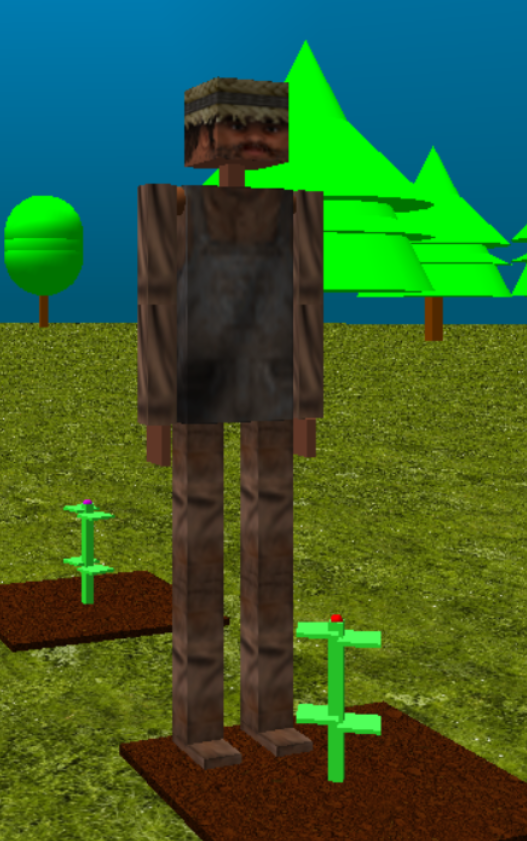
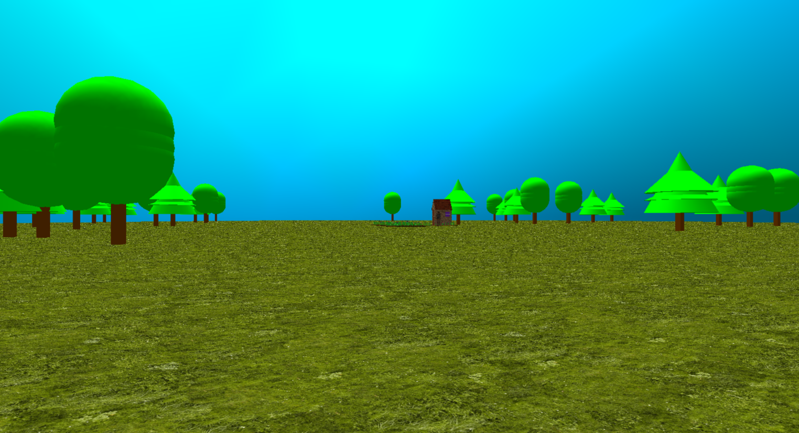

# openGL-farmer
This is a simple openGL aplication writen in c language with a farmer that plant something where there were mouse clicks. This was made as work of the computer graphics discipline at UNIFESP (Universidade Federal de São Paulo).
The application has a rigth click menu that allows you to do some other things like move some parts of the avatar and show a dancing animation performed by the farmer. To compile this project is necessary the language c standard librarys, glu and glut library from openGL and SOIL library that can be find here http://www.lonesock.net/soil.html.

All the code is in `projetofinal.c`

Some images from openGL-farmer:

